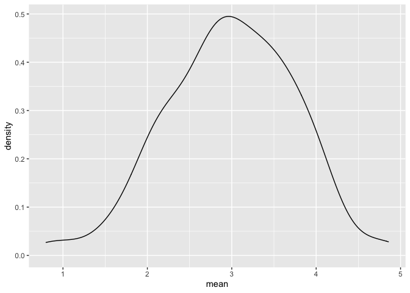

simulation
================
2022-11-03

## Let’s simulate something

I have a function

``` r
sim_mean_sd = function(samp_size, mu = 3, sigma = 4) {
  
  sim_data = 
    tibble(
    x = rnorm(n = samp_size, mean = mu, sd = sigma),
  )
  
  sim_data %>% 
    summarize(
      mean = mean(x),
      sd = sd(x)
    )
}
```

I can “simulate” by running this line.

``` r
sim_mean_sd(30)
```

    ## # A tibble: 1 × 2
    ##    mean    sd
    ##   <dbl> <dbl>
    ## 1  1.80  4.36

## Let’s simulate a lot

Let’s start with a for loop.

``` r
output = vector("list", length = 100)

for (i in 1:100) {
  
  output[[i]] = sim_mean_sd(samp_size = 30)
  
}

bind_rows(output)
```

    ## # A tibble: 100 × 2
    ##     mean    sd
    ##    <dbl> <dbl>
    ##  1  3.37  4.93
    ##  2  2.53  3.52
    ##  3  2.88  4.26
    ##  4  3.05  3.95
    ##  5  3.77  3.81
    ##  6  1.35  4.29
    ##  7  3.10  3.59
    ##  8  2.83  3.84
    ##  9  3.00  4.22
    ## 10  3.31  3.73
    ## # … with 90 more rows

Let’s use a loop function.

``` r
sim_results = 
  rerun(100, sim_mean_sd(samp_size = 30)) %>%
  bind_rows()
```

Let’s look at results …

``` r
sim_results %>%
  ggplot(aes(x = mean)) + geom_density()
```

<!-- -->

``` r
sim_results %>%
  summarise(
    avg_samp_mean = mean(mean),
    sd_samp_mean = sd(mean)
  )
```

    ## # A tibble: 1 × 2
    ##   avg_samp_mean sd_samp_mean
    ##           <dbl>        <dbl>
    ## 1          3.05        0.614

``` r
sim_results %>%
  ggplot(aes(x = sd)) + geom_density()
```

<!-- -->
